# Metaheuristics optimizations:

## Discrete Optimization:

### TSP problems:

National Traveling salesman problems from [math.uwaterloo.ca](http://www.math.uwaterloo.ca/tsp/world/countries.html)

**Djibouti:**

- 38 cities
- optimal tour: 6656

**Qatar:**

- 194 cities
- optimal tour: 9352

**Algorithm used:** 

- Genetic algorithm, well suited for this kind of problem: each chromosome represent a route through all cities. Each gene represent a city. All chromosomes are permutation of the genes.

**Comments:**

- For Djibouti, GA shows good results in a relatively short computational time. 

- For Qatar, I was not able to get good results with applying GA right away. Jmetalpy library was slow, so I decided to switch to DEAP library. Results were better and faster but still far from optimal route. 

  I found some interesting reading on how to initialize population [here](https://www.researchgate.net/publication/283031756_An_Improved_Genetic_Algorithm_with_Initial_Population_Strategy_for_Symmetric_TSP): the idea is to:

  - create clusters of cities using simple k-means

  - find the optimal path between clusters (using GA)

  - for each cluster find optimal path (using GA)

    example Djibouti:

    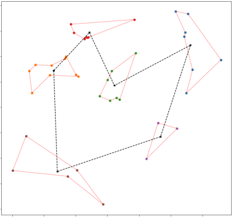

  - link clusters together by disconnecting one edge of the cluster and linking it to next one randomly to create initial population

  - run a GA on this new suboptimal population.

### Comparison results in table below for Djibouti:

| jmetalpy                                                     | DEAP                                                         | Kmean + DEAP                                                 |
| ------------------------------------------------------------ | ------------------------------------------------------------ | ------------------------------------------------------------ |
| [notebook](1-tsp_dj38/tsp_dj38_jmetalpy.ipynb)               | [notebook](1-tsp_dj38/tsp_dj38_deap.ipynb)                   | [notebook](1-tsp_dj38/tsp_dj38_deap_kmeans_init.ipynb)       |
| 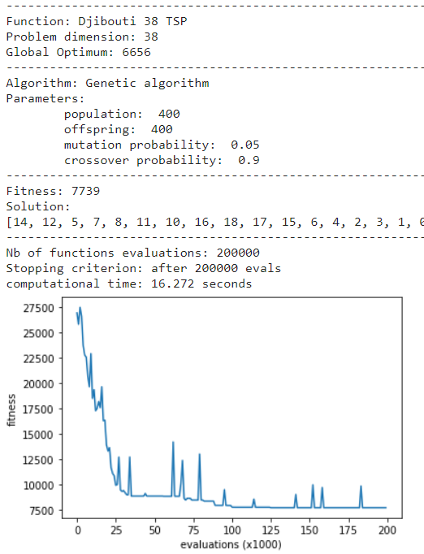 | 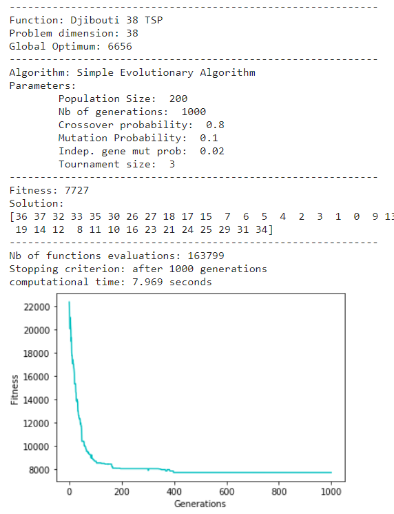 | 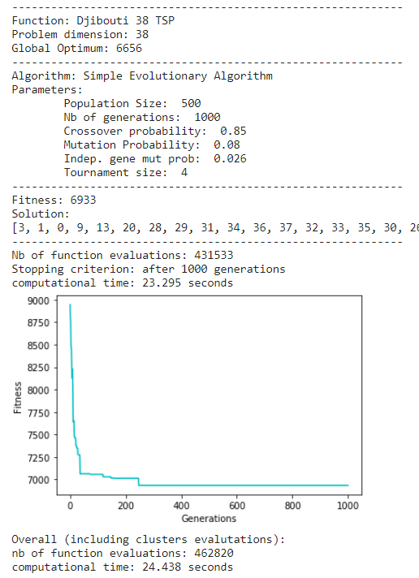 |
| 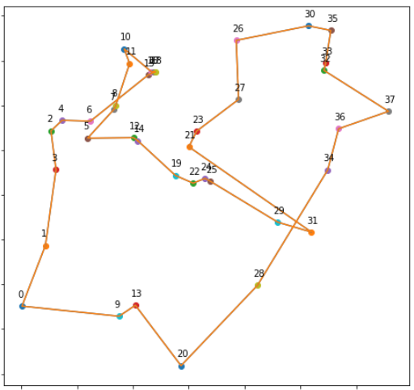 | 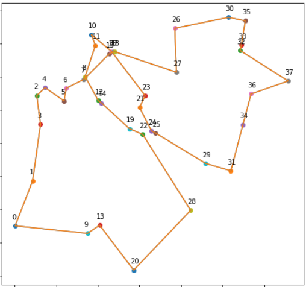 | 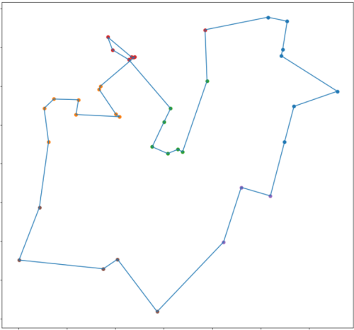 |

### Comparison results in table below for Qatar:

| jmetalpy                                                     | DEAP                                                         | Kmean + DEAP                                                 |
| ------------------------------------------------------------ | ------------------------------------------------------------ | ------------------------------------------------------------ |
| [notebook](2-tsp_qa194/tsp_qa194_jmetalpy.ipynb)             | [notebook](2-tsp_qa194/tsp_qa194_deap.ipynb)                 | [notebook](2-tsp_qa194/tsp_qa194_deap_kmeans_init.ipynb)     |
| 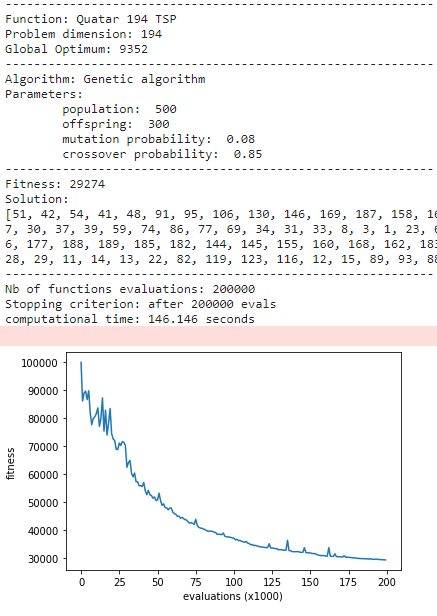 | 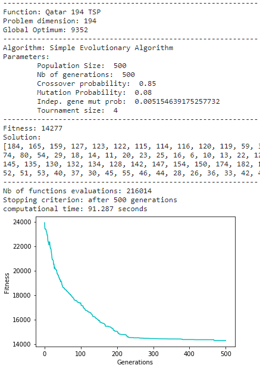 | 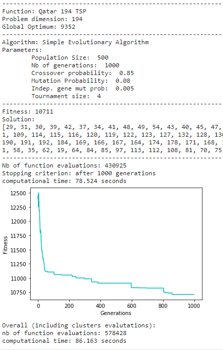 |
| 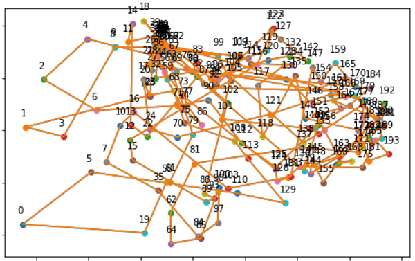 | 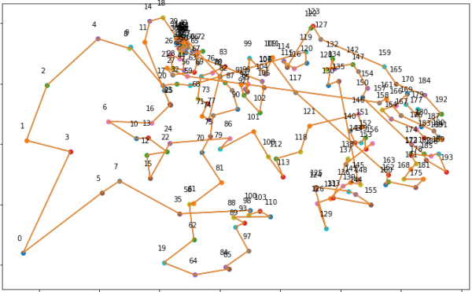 | 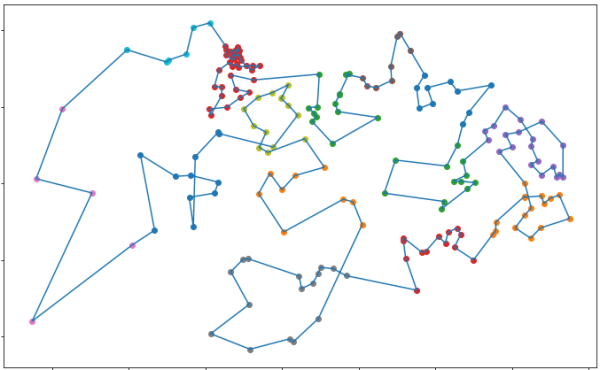 |

## Continuous Optimization:

Target is to optimize benchmark functions (F1 to F6) from CEC2008: description [here](assignment/CEC2008_TechnicalReport.pdf)

Optimization done in dimension 50 and 500.

#### Note on the use CEC functions and data: 

Data and functions code have been provided in C. In order to use it easily with Python, I extracted data to csv file using this [notebook](0-datah_to_csv.ipynb), and recoded the function evaluation in python. To speed up the execution of the code, I used the Numba library which basically recompile the functions at execution time, making execution much faster. 

### F1: Shifted Sphere  

Simple function, using a BFGS algorithm (Quasi Newton family) can solve it fast: less than 1 sec in dimension 500.

| Dimension 50                                                 | Dimension 500                                                |
| ------------------------------------------------------------ | ------------------------------------------------------------ |
| [notebook](3-shifted-Sphere/shifted_sphere_d50.ipynb)        | [notebook](3-shifted-Sphere/shifted_sphere_d500.ipynb)       |
| 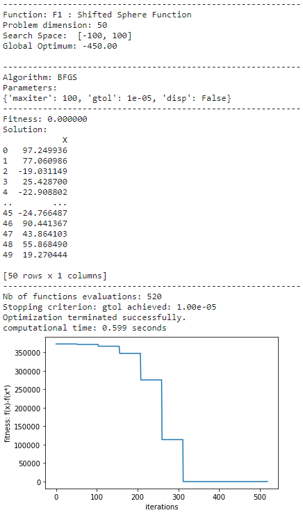 | 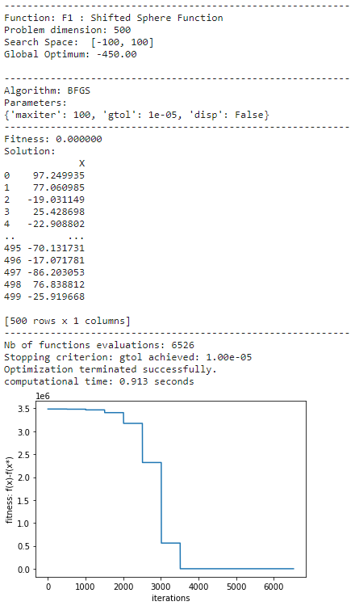 |

### F2: Schwefel problem 2.21

#### D50:

I used an auto apdatative differential evolution algorithm to solve this one

[notebook](4-Schwefel-Problem-2_21/schwefel_problem_221_d50.ipynb)

#### D500:

### F3: Shifted Rosenbrock

#### D50:

[notebook](5-shifted-Rosenbrock/shifted_rosenbrock_d50.ipynb)

#### D500:

### F4: Shifted Rastrigin

#### D50:

[notebook](6-shifted-Rastrigin/shifted_rastrigin_d50.ipynb)

#### D500:

### F6: Shifted Griewank

#### D50:

[notebook](6-shifted-Griewank/shifted_griewank_d50.ipynb)

#### D500:

### F6: Shifted Ackley

#### D50:

[notebook](6-shifted-Ackley/shifted_ackley_d50.ipynb)

#### D500: